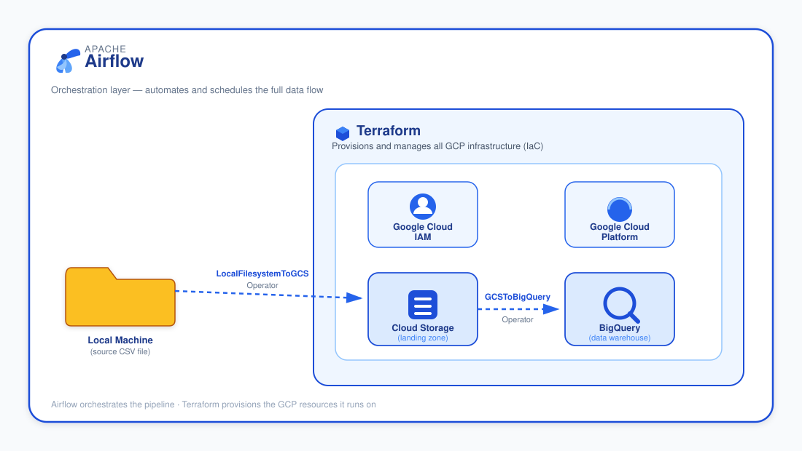

## Problem Statement
Building a data pipeline without automated tools like Airflow, and without modern data storage systems like GCP, has become a significant challenge. In recent years, tools like Airflow have made building data engineering pipelines more efficient, faster, and more automated. This has brought a fantastic development not only to the data engineering world, but to data analysis and data science as well.

My project builds an automated data pipeline that moves B2B marketplace data from a local machine into BigQuery, using Google Cloud Storage as a landing zone, provisioned with Terraform and orchestrated by Apache Airflow (via Astronomer)

## Architecture


Terraform provisions the cloud infastructure. Airflow automates the data through it. no manual scripts, no manual uploads.

**Flow:** Local CSV file → Google Cloud Storage (landing zone) → BigQuery (data warehouse)

## Tech Stack


| Tool | Role |
|---|---|
| **Terraform** | Infrastructure as Code,provisions the GCS bucket, BigQuery dataset, and BigQuery table |
| **Apache Airflow** (via Astronomer) | Orchestration,automates the data transfer from local → GCS → BigQuery |
| **Google Cloud Storage (GCS)** | Landing zone for the raw file before it reaches BigQuery |
| **Google BigQuery** | Cloud data warehouse, final destination for analytics-ready data |
| **Docker** | Runs the Airflow environment via Astronomer's Astro CLI |
| **Linux / Bash** | Used throughout for navigating the Airflow container and managing files |

## Project Structure

## Project Structure

\`\`\`
gcs-airflow-bigquery-pipeline/
├── .astro/                  # Astronomer project config
├── assets/
│   └── architecture-diagram.svg
├── dags/
│   ├── gcs_bq.py             # The DAG — task definitions and dependencies
│   ├── config.py             # Reusable config values (paths, bucket name, project ID, schema)
│   ├── .airflowignore
│   └── data/
│       └── users_clean.csv   # Source dataset
├── terraform/
│   ├── main.tf                # Provider block + GCS bucket, BigQuery dataset & table resources
│   ├── variable.tf            # Reusable variables referenced in main.tf
│   ├── local.tf                # BigQuery table schema, kept separate for readability
│   └── .terraform.lock.hcl
├── tests/
│   └── dags/
│       └── test_dag_example.py
├── Dockerfile
├── .dockerignore
├── .gitignore
├── packages.txt
├── requirements.txt
└── README.md
\`\`\`

> `.env` and `dags/data/application_default_credentials.json` are intentionally excluded from this repo via `.gitignore`,they contain live GCP credentials and should never be committed. See [Authentication](#authenticating-airflow-with-gcp) below for how to set these up yourself.

## Prerequisites

- [Terraform](https://developer.hashicorp.com/terraform/downloads)
- [Docker Desktop](https://www.docker.com/products/docker-desktop/)
- [Astro CLI](https://www.astronomer.io/docs/astro/cli/install-cli)
- [Google Cloud SDK (gcloud CLI)](https://cloud.google.com/sdk/docs/install)
- A GCP project with billing enabled, and the following APIs turned on:
  - Cloud Storage API
  - BigQuery API
  - Service Usage API

---

## Setup

### 1. Provision GCP resources with Terraform

```bash
cd terraform
terraform init
terraform fmt
terraform plan
terraform apply
```

This creates the GCS bucket, the BigQuery dataset, and the BigQuery table — with its schema defined separately in `local.tf` for readability.

### 2. Initialise the Airflow project

```bash
astro dev init
```

Scaffolds the Astronomer/Airflow project structure.

### 3. Add the Google provider

Add this to `requirements.txt` manually — do **not** `pip install` it locally, since Airflow runs inside Docker and won't see anything installed outside the container:

apache-airflow-providers-google==22.2.2

This package provides the GCP operators used in this project: `LocalFilesystemToGCSOperator` and `GCSToBigQueryOperator`.

### 4. Configure `dags/config.py`

```python
DATA_SOURCE_PATH = "/usr/local/airflow/dags/data/users_clean.csv"
GCS_BUCKET_NAME   = "your_bucket_name"
GCS_FILE_NAME     = "your_file.csv"
PROJECT_ID        = "your-gcp-project-id"
table_schema      = [...]  # matches your BigQuery table schema

> ⚠️ `DATA_SOURCE_PATH` must be the file path **inside the Docker container**, not your local machine's path. To find it:
> ```bash
> astro dev bash      # opens a shell inside the running container
> cd dags/data
> pwd                 # copy this path into config.py
> ```

### 5. Start Airflow

```bash
astro dev start
```

Visit **http://localhost:8080** to see the Airflow UI.


## The DAG

`dags/gcs_bq.py` defines two tasks:

```python
with DAG(
    dag_id="gcs_bq",
    schedule="@hourly",
    catchup=False,
    default_args=default_args,
) as dag:

    # Task 1: Upload local file to GCS
    upload_to_gcs = LocalFilesystemToGCSOperator(
        task_id="upload_local_file_to_gcs",
        src=DATA_SOURCE_PATH,
        dst=GCS_FILE_NAME,
        bucket=GCS_BUCKET_NAME,
    )

    # Task 2: Load CSV from GCS into BigQuery
    load_gcs_to_bigquery = GCSToBigQueryOperator(
        task_id="load_gcs_to_bigquery",
        bucket=GCS_BUCKET_NAME,
        source_objects=[GCS_FILE_NAME],
        destination_project_dataset_table=f"{PROJECT_ID}.naija_cart_dataset.naija_market_place",
        source_format="CSV",
        skip_leading_rows=1,
        write_disposition="WRITE_TRUNCATE",
        autodetect=True,
    )

    upload_to_gcs >> load_gcs_to_bigquery
```

Runs hourly ,uploads to GCS first, then loads into BigQuery once the upload succeeds.

## Authenticating Airflow with GCP

This project authenticates using **Application Default Credentials (ADC) with service account impersonation** — avoiding the need to store a raw service account key anywhere in the project.

### How it works

1. **Authentication ("who are you?")** — your personal Google identity is verified locally via:
```bash
   gcloud auth application-default login
```
2. **Authorization ("what can you do?")** happens in two layers:
   - GCP checks whether your identity has the `Service Account Token Creator` role on the target service account — if so, Airflow receives a temporary (1-hour) token to act as that account
   - GCP then checks the *service account's* own IAM roles (e.g. `BigQuery Data Editor`, `Storage Object Admin`) to determine what it's actually allowed to do

### Setup

1. **Add a Google Cloud connection in the Airflow UI** (`Admin → Connections → +`):
   - **Connection Id:** `google_cloud_default`
   - **Connection Type:** Google Cloud
   - Set the impersonation target and project in the extra fields:

   impersonation_chain = your-service-account@your-project-id.iam.gserviceaccount.com
 project             = your-project-id

 2. **Generate your local ADC token:**
```bash
   gcloud auth application-default login
```

3. **Copy the resulting credentials file into your project** (not committed to Git):
dags/data/application_default_credentials.json

4. **Create a `.env` file** at the project root (also not committed):

GOOGLE_APPLICATION_CREDENTIALS=/usr/local/airflow/dags/data/application_default_credentials.json


5. **Restart Airflow to pick up the new configuration:**
```bash
   astro dev restart
```

## What I Learned

- Structuring Terraform cleanly using `locals` for reusable schema definitions
- How Airflow's Docker-based execution model changes file path handling, and how to resolve container paths using `astro dev bash`
- The practical difference between authentication (who you are) and authorization (what you're allowed to do) in GCP IAM
- Implementing service account impersonation as a more secure alternative to raw service account keys


## Author

**Godwin Nosa (Nosa Agbonze)**
Built as the capstone project for the DEC (Data Engineering Community) Cloud Engineering MiniCamp, instructed by Ifeanyichukwu Onyechere.